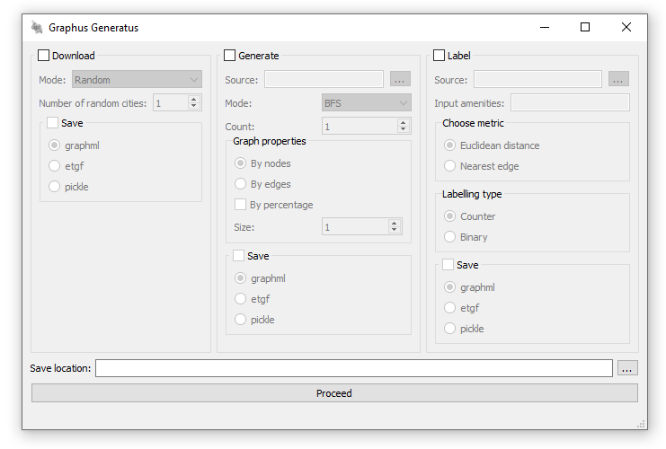

# Projektgruppe Wissensentdeckung:

**Generierung von Straßennetzwerkgraphen**

## Einleitung
Das Programm ist im Rahmen der Projektgruppe "Wissensentdeckung" im Bachelorstudiengang Informatik
an der Rheinischen Friedrich-Wilhelms-Universität Bonn entstanden.  

Das Ziel der Projektgruppe ist die 
"Implementierung eines Programms, das je nach angegebenen Eigenschaften, eine Graphdatenbank von verschiedenen
Straßennetzwerken mit den angegebenen Eigenschaften erstellt." Zusätzlich sollen die Knoten und der Graph selbst
gelabelt und Statistiken über die erzeugten Graphen berechnet werden.

Die Straßennetzwerke werden von [OpenStreetMap](https://www.openstreetmap.org/) heruntergeladen und dann mit Hilfe
von [OSMnx](https://github.com/gboeing/osmnx) in einen Graphen umgewandelt. Das Generieren der Graphen ermöglicht
es aus dem heruntergeladenen Graphen neue Graphen mit ähnlichen Eigenschaften, wie die Anzahl an Knoten / Kanten,
zu erzeugen. Das Labeln der Knoten besteht darin, dass der Nutzer eine Auflistung von Einrichtungstypen (amenities)
wie zum Beispiel _Restaurant, Bar, Kino_ angeben kann und dann für jede Einrichtung im Straßennetz berechnet wird, welcher
der Knoten im generierten Straßennetzwerk der Nächste ist. Jeder Knoten im gelabelten Graphen hat das Attribut
'label_vec', welches ein ganzzahliger Vektor ist und pro Einrichtungstyp einen Eintrag hat.
Wenn ein Knoten im Straßennetzwerk der Nächste zu einer Einrichtung ist, 
wird der zum Einrichtungstypen gehörende Eintrag im Label Vektor angepasst. Das Distanzmaß sowie die Ausprägung des Labelvektors (Binär oder Zähler) lassen sich im Programm anpassen.

Das Projekt macht starken Gebrauch von den Python Bibliotheken: 
- [OSMnx](https://github.com/gboeing/osmnx) zum Herunterladen der Graphen
- [NetworkX](https://networkx.org/) um die Graphen darzustellen und zu modifizieren
- [GeoPandas](https://geopandas.org/en/stable/) einer Erweiterung von Pandas welche zusätzlich 
    Geometrien unterstützt  
  
  
---  
## **Quickstart Guide**

### **Vorraussetzungen**

Um das Programm ausführen zu können, muss mindestens Python 3 sowie folgenden Bibliotheken installiert sein.
```  
* pyside2~=5.13.2
* osmnx~=1.1.1
* networkx~=2.7
* numpy~=1.22.2
* shapely~=1.8.0
* pyproj~=3.3.0
* pandas~=1.4.1
* geopandas~=0.10.2
```

---
### **Installation**:
Zurzeit enthält das Repository **keine** ausführbare Anwendung. Das Programm kann über die Konsole wie folgt aufgerufen werden:
```bash
python main.py
```
---
### **Benutzeroberfläche**

Nach dem Starten des Programms mit obigem Befehl öffnet sich die Benutzeroberfläche.
In den ersten drei Spalten kann ausgewählt werden, welche der drei Prozesse von
Download, Generate und Label ausgeführt werden sollen. Diese werden nach Start des
Programms von "links nach rechts" abgearbeitet.



#### **Download**

<ins>_Mode_</ins> gibt die Quelle der Namen der Städte, welche runtergeladen werden sollen, an.  
Möglich sind:
1. **Random**: Wählt zufällig Städte aus festgelegter Liste von Städten aus
2. **From Text Input**: Gebe Städte als `city,country;city,country;...` in das Textfeld ein
3. **From File**: Datei in welcher pro Zeile ein  `city,country` Paar gegeben ist  


#### **Generate**
Ist _Download_ nicht aktiviert, muss der Ordner mit den einzulesenden Graphen angegeben werden.
Diese dürfen im 
<span style="background-color: #edede8; border-radius: 2px">.graphml</span>,
<span style="background-color: #edede8; border-radius: 2px">.etgf</span> oder
<span style="background-color: #edede8; border-radius: 2px">.pickle</span> Format sein.
Genaueres über den Aufbau und den geforderten Inhalt kann im [Abschlussbericht der Projektgruppe](Abschlussbericht_Projektgruppe_Maschinelles_Lernen_Thema_4.pdf) nachgelesen werden.  
  
Die möglichen Modi mit welchen generiert werden kann, können im Feld <ins>_Mode_</ins> gewählt werden:
1. **BFS**: Breitensuche
2. **Compact BFS**: Erzeugt kompaktere Graphen (aus geometrischer Sicht) (kurze/wenige Ausläufer)
3. **Radius**: Breitensuche innerhalb des angegebenen Radius um den Startknoten
4. **Bounding Box**: Breitensuche innerhalb der angegebenen Bounding Box um den Startknoten

<ins>_Count_</ins> gibt an wie viele Graphen pro Stadt generiert werden sollen. 

<ins>_Graph properties_</ins>
gibt an nach welcher Eigenschaft die Graphen generiert werden sollen:
* Knoten oder Kantenanzahl als ablsoluter Wert oder in Prozent (BFS, BFS Compact)
* Radius in Metern (Radius)
* Breite und Höhe der Bounding Box (Bounding Box)
  
  
#### **Label**
Wenn Download und Generate nicht aktiviert sind, muss der Ordner mit den zu labelnden Graphen angegeben werden. 


<ins>_Input amenities_:</ins> Aufzählung der Einrichtungstypen als `amenity1,amenity2,...`  
<ins>_Choose metric_:</ins> Distanzmaß um nächste Nachbarn zu ermitteln (siehe [Abschlussbericht](Abschlussbericht_Projektgruppe_Maschinelles_Lernen_Thema_4.pdf))  
<ins>_Labelling type_:</ins> Labelvektor als Zähler **wie oft** oder binäre Angabe **ob** Knoten nächster Nachbar einer
Einrichtung des jeweiligen Typs ist


#### **Save**
Nach jedem Schritt kann in einem der drei vorgegebenen Formaten gespeichert werden.  
**<span style="background-color: #ebf7fc; border-radius: 4px">Hinweis:</span>** Es muss mindestens bei einer der
ausgewählten Prozesse das Speichern ausgewählt sein.

#### **Save Location**
Die _save location_ gibt an, wo die generierten Graphen und andere erzeugte Dateien gespeichert werden sollen.  
Es wird im angegebenen Ordner ein neuer Ordner mit folgender Struktur angelegt.
```bash
.
└── graphs_<datum>
    ├── cache
    │   ├── <Anfrage Hash>.json
    │   └── ...
    ├── download
    │   ├── <graphname>.<speicherformat>
        └── ...
    ├── generate
    │   ├── <graphname>.<speicherformat>
    │   └── ...
    ├── label
    │   ├── <graphname>.<speicherformat>
    │   └── ...
    ├── log.txt
    └── statistics.txt

```